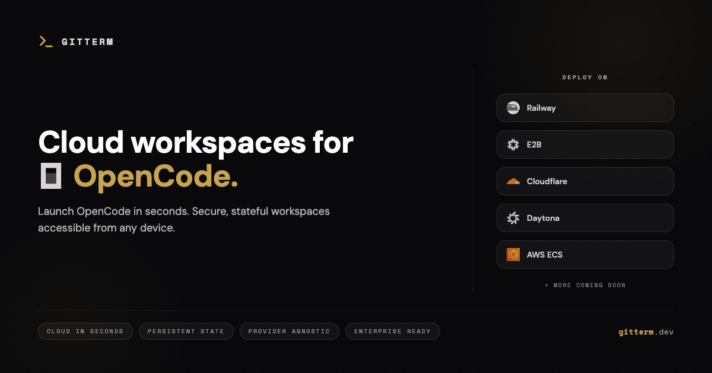

Run Opencode instances your way. GitTerm supports multiple cloud providers of servers or sandboxes for remote Opencode sessions.

[](https://railway.com/deploy/gitterm?referralCode=o9MFOP&utm_medium=integration&utm_source=template&utm_campaign=generic)

## What GitTerm does

- Cloud workspaces for remote Opencode sessions
- Browser-accessible TTYD for the Opencode TUI
- Server-only Opencode URLs for desktop or local clients

## Deploy on Railway

The fastest way to self-host:

1. Click the deploy button above.
2. Set the required env vars Railway asks for, especially `ADMIN_EMAIL` and `ADMIN_PASSWORD`.
3. If you want subdomain routing, give the `proxy` service a wildcard domain like `*.your-domain.com`.
4. Configure your workspace providers in the admin panel before users create workspaces.

## Services

Required services:

| Service | Purpose |
| --- | --- |
| PostgreSQL | Database |
| Redis | Cache and pub/sub |
| server | Main API |
| web | Dashboard and auth UI |
| proxy | Caddy reverse proxy |
| listener | Webhook and event ingress |
| worker | Background jobs |

Recommended worker cron:

| Worker | Schedule | Purpose |
| --- | --- | --- |
| `idle-reaper` | `*/10 * * * *` | Stops idle workspaces and enforces quotas |

## Routing

Caddy can route workspaces either by path or subdomain:

```text
https://your-domain.com/ws/{workspace-subdomain}/
https://{workspace-subdomain}.your-domain.com
https://{port}-{workspace-subdomain}.your-domain.com
```

Path routing is useful when you do not control wildcard DNS. Subdomain routing is usually better for apps that rely on relative asset paths.

## Provider Setup

Provider configuration is driven by `packages/schema/src/provider-registry.ts`. Current provider definitions include Railway, AWS, Cloudflare Sandbox, and E2B.

Open the admin panel and add the required values for each provider you want to offer.

### Webhook Base URL

Webhook endpoints depend on how you expose GitTerm:

- Through the public proxy: `https://<your-base-domain>/listener/trpc/...`
- Directly to the listener service: `https://<listener-base-url>/trpc/...`

If your `listener` service is not public, use the proxy form.

### Railway

Set these values in the admin panel:

- `API URL`
- `API Token`
- `Project ID`
- `Environment ID`
- optional: `Default Region`
- optional: `Public Railway Domains`

Webhook setup:

- Endpoint via proxy: `https://<your-base-domain>/listener/trpc/railway.handleWebhook`
- Endpoint via listener: `https://<listener-base-url>/trpc/railway.handleWebhook`
- Accept these Railway events: `Deployment Failed`, `Deployment Deploying`, `Deployment Slept`, `Deployment Deployed`

### E2B

[](https://e2b.dev/startups)

E2B is configured from the GitTerm admin panel and the E2B dashboard at `https://e2b.dev/`.

Set these values in the admin panel:

- `API KEY`
- `Webhook Secret`

In E2B, create or update a sandbox lifecycle webhook and use:

- Endpoint via proxy: `https://<your-base-domain>/listener/trpc/e2b.handleWebhook`
- Endpoint via listener: `https://<listener-base-url>/trpc/e2b.handleWebhook`
- Signature secret: use the same value you saved as `Webhook Secret` in GitTerm

Minimum events GitTerm currently uses:

- `sandbox.lifecycle.paused`
- `sandbox.lifecycle.resumed`
- `sandbox.lifecycle.killed`

### Cloudflare Sandbox (WIP)

Set these values in the admin panel:

- `Worker URL`
- `Callback Secret`

Deploy the worker from `packages/api/src/providers/cloudflare/agent-worker/src/index.ts`:

```bash
cd packages/api
bun run wrangler:deploy
```

## GitHub Integration

GitHub integration is optional. It allows users to connect repositories and perform git actions from their workspaces.

Set these env vars on the `server` service:

- `GITHUB_APP_ID`
- `GITHUB_APP_PRIVATE_KEY`

Set both or neither.

GitHub App setup:

- Callback URL: `https://<api-url>/api/github/callback`
- Webhook via proxy: `https://<your-base-domain>/listener/trpc/github.handleInstallationWebhook`
- Webhook via listener: `https://<listener-base-url>/trpc/github.handleInstallationWebhook`

## Development

See `CONTRIBUTING.md` for local setup and service URLs.

Common commands:

```bash
bun run dev
bun run build
bun run check-types
bun run db:push
bun run db:studio
bun run db:generate
bun run db:migrate
```

## Links

- Website: https://gitterm.dev
- OpenCode: https://opencode.ai
- CLI: https://www.npmjs.com/package/gitterm
- GitHub: https://github.com/OpeOginni/gitterm

## License

MIT. See `LICENSE`.
