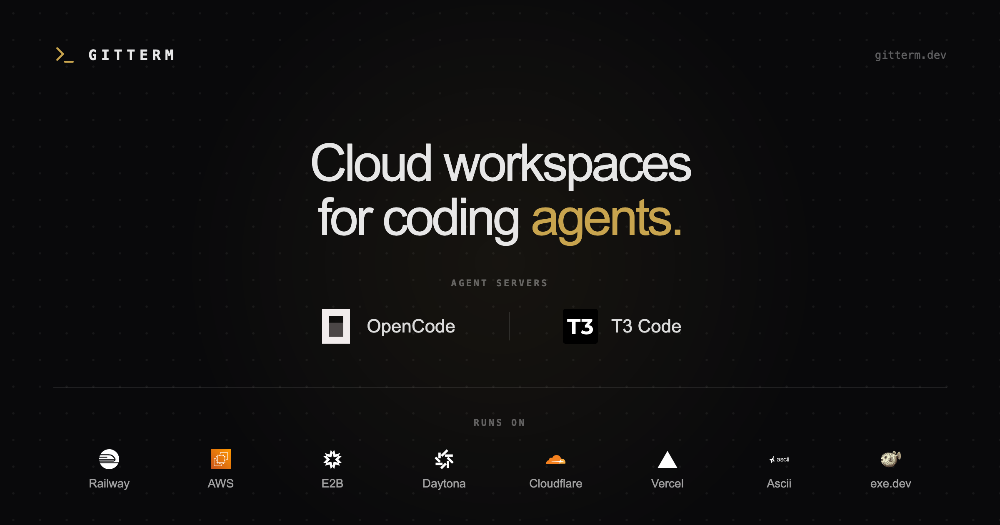

Run your coding agent in the cloud. GitTerm runs OpenCode or T3Code in remote workspaces on the cloud provider or sandbox of your choice, so you can code from any device with your own model keys.

[](https://railway.com/deploy/gitterm?referralCode=o9MFOP&utm_medium=integration&utm_source=template&utm_campaign=generic)

## What GitTerm does

- Runs OpenCode or T3Code in cloud workspaces across multiple providers
- Opens the agent TUI in your browser through TTYD
- Gives you server-only agent URLs for desktop or local clients
- Exposes any workspace port behind a shareable URL, so you can preview and test your app live
- Keeps your model keys yours (bring your own keys, no markup)

## Sandbox lifecycle

GitTerm helps you manage a sandbox from first boot through cleanup:

- **Create** a workspace from a repository and the provider, agent, and configuration you choose
- **Open** a running workspace in the browser, connect from a local client, or share a live app preview
- **Pause** workspaces when you are finished for now, preserving their state while stopping active compute
- **Resume** a paused workspace and continue from where your agent left off
- **Share** a workspace with teammates when you need to collaborate
- **Terminate** a workspace when the work is complete

## Deploy on Railway

The fastest way to self-host:

1. Click the deploy button above.
2. Set the required env vars Railway asks for, especially `ADMIN_EMAIL` and `ADMIN_PASSWORD`.
3. If you want subdomain routing, give the `proxy` service a wildcard domain like `*.your-domain.com`.
4. Configure your workspace providers in the admin panel before users create workspaces.

## Deploy with Docker Compose

`docker-compose.selfhost.yml` runs the whole stack from the published GHCR images behind the Caddy proxy:

```bash
cp .env.selfhost.example .env.selfhost
# fill in PUBLIC_URL, POSTGRES_PASSWORD and the secrets (openssl rand -hex 32)
docker compose --env-file .env.selfhost -f docker-compose.selfhost.yml up -d
```

Open `PUBLIC_URL` (default `http://localhost:8888`) and sign in with `ADMIN_EMAIL`/`ADMIN_PASSWORD`. Pin a release with `GITTERM_IMAGE_TAG=vX.Y.Z`, or add `--build` to build from source.

`ROUTING_MODE` picks how workspaces are exposed (see [Routing](#routing)):

- `path` (default): everything on one origin, `PUBLIC_URL/ws/<workspace>/`. Works with a single A record and one certificate.
- `subdomain`: `<port>-<workspace>.<PUBLIC_HOST>`. Point a wildcard DNS record (`*.your-domain.com`) at the host and terminate TLS with a wildcard certificate in front of the `proxy` service (any reverse proxy with a DNS-01 ACME challenge, or Cloudflare, works). The proxy itself listens on plain HTTP.

`docker-compose.yml` (no suffix) is different: it only starts Postgres and Redis for local development, where the apps run natively. See `CONTRIBUTING.md`.

### Database migrations and seeding

The `server` image prepares the database itself on every start (`apps/server/docker-entrypoint.sh`), in order:

1. **Migrations**: applies the committed SQL in `packages/db/src/migrations` and records progress in `drizzle.__drizzle_migrations`.
2. **Seed**: upserts the provider, agent, image, region and model catalogs.
3. **Admin seed**: creates or updates the `ADMIN_EMAIL` account.

Every step waits for Postgres to accept connections and holds a Postgres advisory lock, so running several `server` replicas is safe: the first one does the work and the others wait, then find nothing to do. A failure in any step aborts startup so a half-migrated server never serves traffic.

To run these steps yourself instead (for example as a release job before rolling the fleet), set `SKIP_MIGRATIONS=true`, `SKIP_SEED=true` and/or `SKIP_ADMIN_SEED=true` on the `server` service and run the same commands from the image or a checkout with `DATABASE_URL` set:

```bash
docker compose -f docker-compose.selfhost.yml run --rm --no-deps server \
  sh -c 'bun run dist/scripts/migrate.mjs --prod && bun run dist/scripts/seed.mjs --prod'
```

From a checkout, the equivalents are `bun run db:migrate:prod` and `bun run db:seed:prod`.

`DB_WAIT_TIMEOUT_MS` (default `60000`) controls how long the steps wait for the database before giving up.

## Services

Required services:

| Service    | Purpose                   |
| ---------- | ------------------------- |
| PostgreSQL | Database                  |
| Redis      | Cache and pub/sub         |
| server     | Main API                  |
| web        | Dashboard and auth UI     |
| proxy      | Caddy reverse proxy       |
| listener   | Webhook and event ingress |
| worker     | Background jobs           |

Worker cron jobs:

| Worker        | Schedule       | Purpose                                   |
| ------------- | -------------- | ----------------------------------------- |
| `idle-reaper` | `*/10 * * * *` | Stops idle workspaces and enforces quotas |

On Railway the worker runs as a Cron job (run-once per invocation, `REAP_INTERVAL_MINUTES=0`).
In Docker Compose it loops in-process — set `REAP_INTERVAL_MINUTES` (default `10`) to control how often it reaps.

## Routing

Caddy can route workspaces either by path or subdomain:

```text
https://your-domain.com/ws/{workspace-subdomain}/
https://{workspace-subdomain}.your-domain.com
https://{port}-{workspace-subdomain}.your-domain.com
```

Use path routing when you do not control wildcard DNS. Use subdomain routing for apps that rely on relative asset paths.

Open a port on a running workspace to get a live URL like `https://{port}-{workspace-subdomain}.your-domain.com`. Each port is either:

- **Private** (default): only the workspace owner's browser, signed in to GitTerm, can reach it. Good for previewing a dev server while an agent works on it.
- **Public**: anyone with the URL can reach it, with no GitTerm login. Use this for APIs, webhook receivers, and demos.

You can switch a port between private and public from the dashboard, with `gitterm ports visibility <port> <private|public>`, or with the SDK. GitTerm's own session cookies are stripped before requests reach workspace apps.

## Providers

GitTerm can run workspaces on any of these providers. Configure each one in the admin panel before users create workspaces. Click a provider for its full setup guide.

| Provider                                                         | Type    | Webhook | Setup guide                                              |
| ---------------------------------------------------------------- | ------- | ------- | -------------------------------------------------------- |
| [Railway](https://railway.com)                                   | Compute | Yes     | [Guide](packages/api/src/providers/railway/README.md)    |
| [AWS](https://aws.amazon.com/)                                   | Compute | No      | [Guide](packages/api/src/providers/aws/README.md)        |
| [E2B](https://e2b.dev/)                                          | Sandbox | Yes     | [Guide](packages/api/src/providers/e2b/README.md)        |
| [Daytona](https://daytona.io/)                                   | Sandbox | No      | [Guide](packages/api/src/providers/daytona/README.md)    |
| [Cloudflare Sandbox](https://developers.cloudflare.com/sandbox/) | Sandbox | No      | [Guide](packages/api/src/providers/cloudflare/README.md) |
| [Vercel Sandbox](https://vercel.com/docs/sandbox)                | Sandbox | No      | [Guide](packages/api/src/providers/vercel/README.md)     |
| [boat](https://boat.dev) (by ASCII)                              | Sandbox | No      | [Guide](packages/api/src/providers/ascii/README.md)      |
| [exe.dev](https://exe.dev/sandbox)                               | Sandbox | No      | [Guide](packages/api/src/providers/exedev/README.md)     |

[](https://e2b.dev/startups)

Field definitions for every provider live in `packages/schema/src/provider-registry.ts`.

### Webhook Base URL

Providers that use webhooks send events to the GitTerm listener. The endpoint depends on how you expose GitTerm:

- Through the public proxy: `https://<your-base-domain>/listener/trpc/...`
- Directly to the listener service: `https://<listener-base-url>/trpc/...`

If your `listener` service is not public, use the proxy form. Exact endpoints are in each provider guide.

## GitHub Integration

GitHub integration is optional. It allows users to connect repositories and perform git actions from their workspaces.
An admin must enable GitHub repository access in **Admin → Integrations** before users can connect.
The admin chooses a GitHub App (ID, private key, and webhook secret) that users install,
or an admin-shared fine-grained PAT that users explicitly select when creating a workspace.
The two modes are mutually exclusive. Neither requires GitHub login: email-only self-hosted
deployments work with either method. GitHub login remains a separate setting.

Legacy GitHub App environment setup remains supported when no App has been saved in the admin panel.
Set these env vars on the `server` service if using that legacy route:

- `GITHUB_APP_ID`
- `GITHUB_APP_PRIVATE_KEY`
- `GITHUB_APP_CLIENT_ID` (for login with the same GitHub App)
- `GITHUB_APP_CLIENT_SECRET` (for login with the same GitHub App)

Set `GITHUB_APP_ID` and `GITHUB_APP_PRIVATE_KEY` together for repo integration. Set
`GITHUB_APP_CLIENT_ID` and `GITHUB_APP_CLIENT_SECRET` if GitHub login is enabled.
A separate GitHub OAuth App is not required.

For GitHub sign-in on a **managed** deployment, configure both services:

```dotenv
# Server service (apps/server/.env.development.local for local dev)
DEPLOYMENT_MODE=managed
ENABLE_GITHUB_AUTH=true
ENABLE_EMAIL_AUTH=false
GITHUB_APP_CLIENT_ID=<your-app-client-id>
GITHUB_APP_CLIENT_SECRET=<your-app-client-secret>

# Web service (apps/web/.env.development.local for local dev)
NEXT_PUBLIC_DEPLOYMENT_MODE=managed
NEXT_PUBLIC_ENABLE_GITHUB_AUTH=true
NEXT_PUBLIC_ENABLE_EMAIL_AUTH=false
```

The App ID and private key do not enable sign-in. If the web deployment mode is
unset, the login form defaults to email-only self-hosted mode even when the server
has GitHub credentials. Restart both local dev processes after changing these
files; rebuild and redeploy the web service for production changes because
`NEXT_PUBLIC_*` values are baked into the browser bundle by Next.js. Keep OAuth
secrets on the server only—never use a `NEXT_PUBLIC_*` variable for them.

GitHub App setup:

- Callback URL: `https://<base-domain>/api/auth/callback/github`
- Setup URL: `https://<api-host>/api/github/callback` (e.g. `https://<base-domain>/api/github/callback` or `https://api.<base-domain>/api/github/callback`)
- Webhook via proxy: `https://<your-base-domain>/listener/trpc/github.handleInstallationWebhook`
- Webhook via listener: `https://<listener-base-url>/trpc/github.handleInstallationWebhook`

## Google Cloud Integration

Google Cloud Workload Identity Federation gives workspaces keyless `gcloud` and ADC access through
short-lived GitTerm identity assertions. An admin enables Google Cloud and generates the
deployment-wide signing key in **Admin → Integrations**. Users connect narrowly scoped service
accounts from the Integrations dashboard. Existing deployments may continue using the legacy
`WORKLOAD_IDENTITY_*` settings until they configure the issuer in the app; the database config
takes precedence. See
[`docs/google-workload-identity.md`](docs/google-workload-identity.md) for setup and IAM guidance.

## MCP and Executor

An admin enables **MCP servers** and/or **Executor** in **Admin → Integrations**. Users save
personal HTTPS MCP endpoints with no auth, bearer tokens, or custom headers and explicitly select
them when creating an OpenCode workspace. Multiple servers and accounts are supported.

OpenCode connects directly to each server. Executor is an optional preset, not a required
dependency: use its organization endpoint and PAT to access an existing tool catalog. GitTerm
does not aggregate tools, proxy tool traffic, or manage MCP OAuth. Credentials are encrypted at
rest, but attached workspace agents can read them. See [the MCP guide](docs/mcp-integrations.md)
for setup, SDK examples, supported protocols, and revocation limitations.

GitLab and Bitbucket remain planned connectors. The deployment encryption master key stays in
the deployment secret manager so integration secrets in the database are encrypted independently.

The complete storage, broker, rotation, audit, and provider threat model is documented in
[`docs/credential-security.md`](docs/credential-security.md).

## Slack and Discord bots

[`@gitterm/slack-bot`](packages/slack-bot) and [`@gitterm/discord-bot`](packages/discord-bot)
put an OpenCode agent on a repository behind a chat bot you host yourself, with no public URL:

```sh
SLACK_BOT_TOKEN=xoxb-… SLACK_APP_TOKEN=xapp-… GITTERM_API_TOKEN=gt_… \
  npx @gitterm/slack-bot --repo https://github.com/acme/app
```

or from code, standalone or added to a Slack/Discord bot you already run:

```ts
import { createSlackBot } from "@gitterm/slack-bot";

await createSlackBot({ repo: "https://github.com/acme/app" }).start();
```

Set one up from **Bots** in the dashboard: it walks through a model key, GitHub, the repository,
and tools, creates a correctly scoped token, and hands you the `.env` (and, for Slack, a
one-click app). Each repository gets one sandbox that pauses when idle and wakes on the next
message; each chat thread is one agent session. Agent questions and tool approvals become buttons
in the thread. GitHub access is attached automatically; tools (MCP, Executor) are attached by
name. The shared engine, [`@gitterm/bot`](packages/bot), can drive other chat platforms.

## Development

See `CONTRIBUTING.md` for local setup and service URLs.

Common commands:

```bash
bun run dev
bun run build
bun run check-types
bun run db:studio:dev
bun run db:generate     # write a new SQL migration after editing packages/db/src/schema
bun run db:migrate:dev  # apply committed migrations to the local docker postgres
bun run db:seed:dev
```

Schema changes ship as migrations: edit the schema, run `db:generate`, commit the new files under `packages/db/src/migrations`, and `db:migrate:*` applies them. `bun run db:push` syncs the schema directly without writing a migration; it is fine for throwaway local databases but will drift from the journal, so do not use it against a database you intend to migrate later.

## Links

- Website: https://gitterm.dev
- OpenCode: https://opencode.ai
- T3Code: https://github.com/pingdotgg/t3code
- GitHub: https://github.com/OpeOginni/gitterm

## License

MIT. See `LICENSE`.

## Disclaimer

GitTerm is an independent project and is not affiliated with, endorsed by, or sponsored by OpenCode, T3Code, or their maintainers. "OpenCode", "T3Code", and any related names or marks belong to their respective owners.
